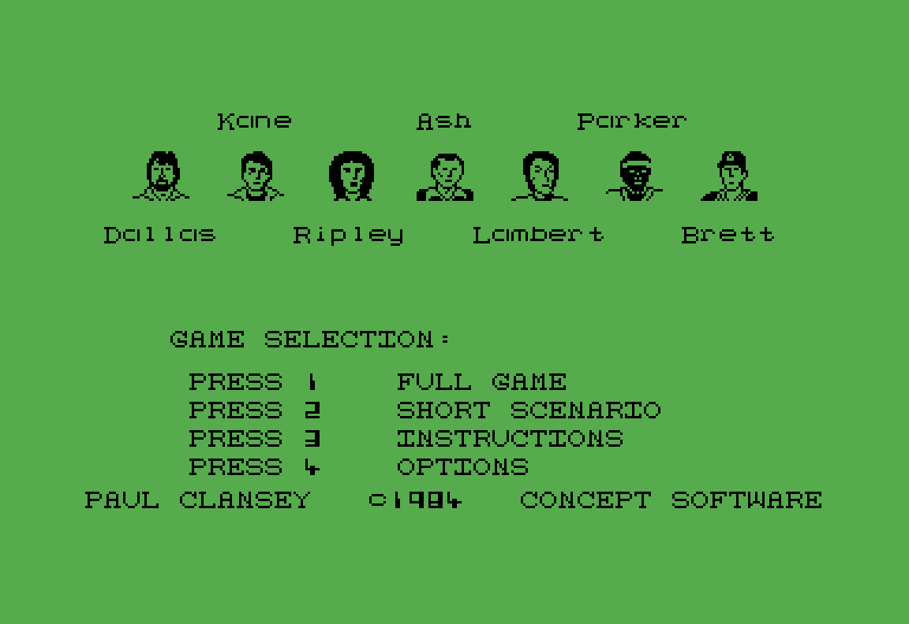
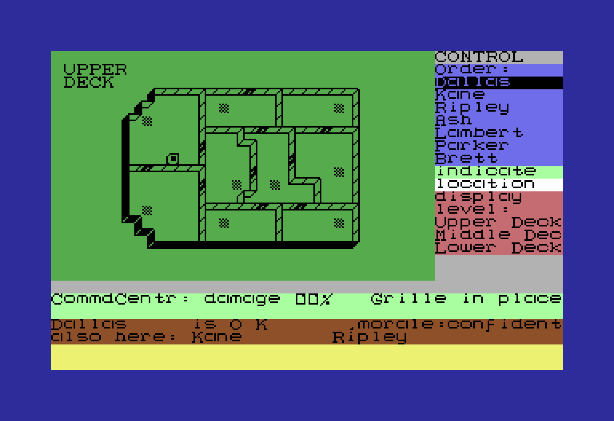
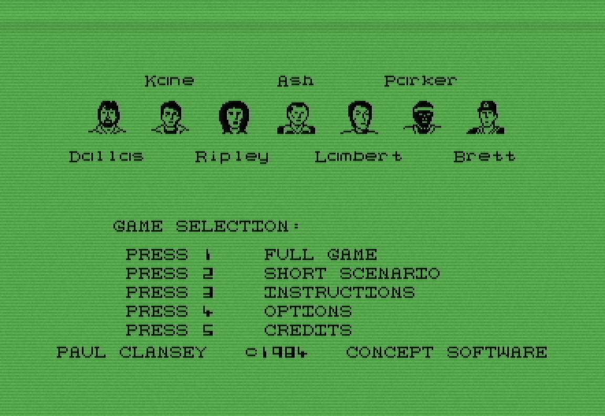
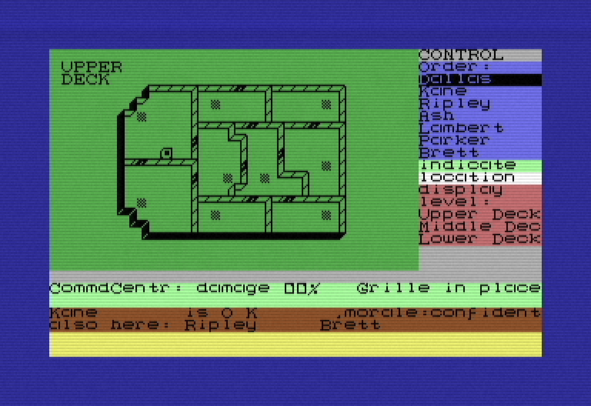
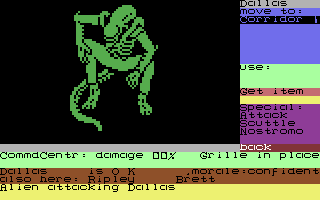
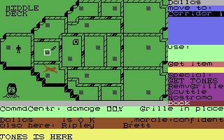
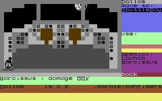
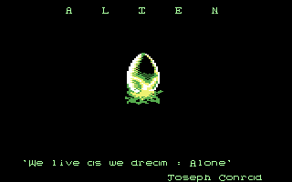
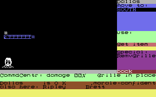
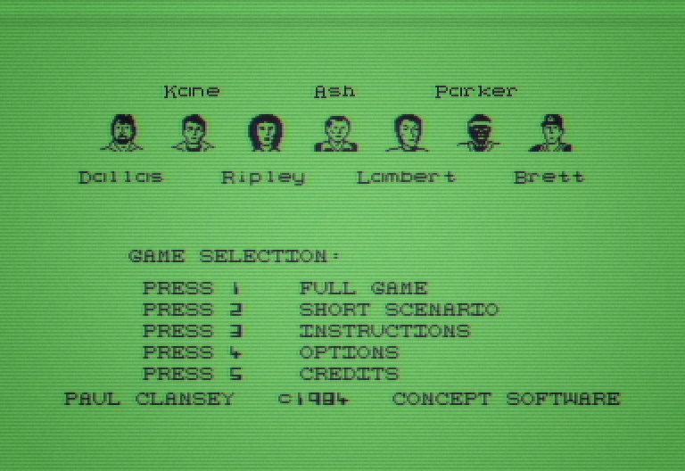

# Alien (1984): a Python remake

A playable reimplementation of **Alien** (Mind Games / Argus Press Software,
1984) for the Commodore 64, rebuilt in Python by reading the original disk's
6502 code and copying what it actually does.

* **`alientools`**: a stdlib-only toolkit that reads a `.nib`, `.g64` or `.d64`
  image, decodes it to sectors, rebuilds the CBM-DOS filesystem, extracts the
  program and disassembles the 6502 code.
* **`alien_remake`**: the game itself, built from what that reading turned up.

**No game data is distributed here.** You supply your own disk image; the first
run decodes the graphics, sprites, text and music out of it onto your machine.

## The game, and the intent behind it

You command the crew of the *Nostromo* while the Alien moves through its rooms
and air ducts hunting them. You never control anyone directly: you pick a crew
member, give them one order (move, take an item, use it, attack, remove a
grille) and watch. Each has their own composure, speed and willingness to obey.
Ash may have other priorities.

Three ways to win: kill the Alien, blow it out of an airlock, or reach the
shuttle *Narcissus*. Many more ways to lose.

This started as a full disassembly of the original 6502 code, then got checked
two ways: against the manual, and against real play sessions run side by side
with the original game in an emulator. Where the two disagreed, the code won —
the manual promises a few things the disk doesn't actually do. That covers the
Personality Control System, three decks and 34 rooms, the duct network, the
Alien's own route tables, per-character action timings, hypersleep and
auto-destruct, the SID intro music, and the loader front end. Anything that
couldn't be pinned down this way is flagged rather than guessed at (see
[docs/re/](docs/re/) if you want to see the receipts).

<p align="center">
  
  
</p>

*Running under the **ORIGINAL** preset: the 1984 disk's own crew-selection
screen and CONTROL-panel gameplay, matching what the real machine shows. No
CRT effect, the classic boot chain, nothing added.*

This version includes an Update and Expanded preset which adds new features,
quality of life improvements, mouse control, and extras listed below:

* **An optional analog CRT look** — scanlines, chroma bleed, phosphor trail,
  the kind of screen the film's own computers glow like. Off by default,
  and the picture underneath is pixel-identical without it.
* **Sound effects**, some of them your own recordings, some sourced from
  [Freesound.org](https://freesound.org) and credited in full further down.
* **Feedback the original never gave you** — a notice when a crew member
  hits the Alien or the Alien hits them, and a few other places the disk
  stayed silent about what just happened.
* **Mouse control**, everywhere it makes sense.
* **A quicker boot chain**, if you'd rather skip the full loading sequence.
* **A fifth CREDITS row**, acknowledging any media you've supplied.
* **True randomness for the opening death and the hidden android.** The
  original disk always draws the opening casualty from the same three
  crew members (Brett, Lambert or Kane) and the android from a similarly
  short list. Here, anyone can go either way.

None of it changes how the game itself plays — every addition is off under
the **Original** preset, which stays a true 1:1 match to the 1984 disk:

<p align="center">
  
  
</p>

*The same two screens, updated and expanded: the extra CREDITS row, and the
analog **CRT layer** (`--crt subtle|full`), NTSC chroma bleed, scanlines at
the C64's line pitch, phosphor trail, and a rolling raster bar. A look, not a
fact. Off by default, and the picture underneath is pixel-identical without
it.*

A few more scenes, to give a feel for the rest of the game:

<p align="center">
  
  
  
</p>
<p align="center">
  
  
  
</p>

*Left to right, top row: the Alien attacking Dallas; Jones on one of his runs
across the screen; the Narcissus cockpit, the last screen the map can't show.
Bottom row: the title card with the full "ALIEN" spelled out over the egg; the
duct view a character sees from inside the ducts (their own spot lit white,
the runs leading away from it in light blue, everything else genuinely dark);
and the CRT layer's small "gentle" flicker, the one that plays over a crew
switch rather than a full scramble.*

## Turn-based mode

Real-time is the default, same as the original disk. There's also a
**turn-based** mode (`turns` on the options screen, or `--headless-turns` from
the command line) for anyone who'd rather think between moves than watch a
clock: nothing happens until you give an order, and once you do it plays out
in full before anyone else gets a turn.

* Crew and creatures **go in a shuffled order** rolled at the start of the run
  — not the original disk, which has no turn structure at all — and the panel
  tells you whose turn it is.
* Each crew member gets **two action points a turn** (about one move and one
  action), shown right on the panel along with a `[K] SKIP` reminder if you'd
  rather pass.
* When your last point is spent, or you skip, the **next character in line is
  selected for you automatically** — you're never left staring at whoever's
  menu happened to be open.
* When the Alien or Jones takes its turn, a line at the bottom says so
  ("THE ALIEN TOOK ITS TURN") without spelling out what actually happened —
  the same information blackout the real-time mode already keeps around the
  ROM's own AI.

It's simulated at exactly the same rate real-time play uses; the only thing
that changes is when the clock is allowed to move. A genuine transcript from
the command line:

```
$ python -m alien_remake --headless-turns 8 --death fixed
settings from .../settings.toml: crt=subtle, front_end=quick, jones=patient, ...
turns=8 tick=480 phase=RUNNING
```

## What's actually different, if you've played the original

Under the `ORIGINAL` preset the game plays exactly like the 1984 disk — same
rules, same odds, same screens. The differences worth knowing about are all
about **feedback**: several times, the original simply didn't tell you
whether something worked, and the remake fills that in rather than leaving you
guessing.

The clearest example: **attacking the Alien gave you no feedback at all** on
the original disk. The ROM has a string sitting right there in memory —
`{name} hits Alien` — built for exactly this moment, and the code that decides
whether your attack landed never actually prints it. So on the real 1984 game
you'd swing at the Alien and just... not be told what happened. The remake
wires that existing string up to the moment it was clearly meant for, so you
now get "Dallas hits Alien" the instant a hit lands. Nothing about the odds or
the outcome changed — only whether you're told about it.

A few more of the same shape:

* **The Alien wounding a crew member** used to be silent text-wise — you'd
  hear the attack-alert sound and that was it. There's now an "Alien wounds
  \<name>" line to go with the sound.
* **An item getting destroyed mid-attack** (the tracker, the net) is now
  announced instead of just quietly vanishing from your inventory.
* **Turn-based mode's own panel** (see above) exists purely to answer "whose
  turn is it and what can they still do", a question real-time play never has
  to ask because everyone's always free to act.

None of this changes what the game *does* — the same rolls, the same rules,
the same ways to win and lose. It only changes whether you find out about it,
which the 1984 disk was sometimes surprisingly quiet about.

## Install

The [Steam Deck](#steam-deck) section below has its own walkthrough. Short
version for everyone else:

```powershell
git clone https://github.com/OuijaGhost/alien-remake.git
cd alien-remake
python -m venv .venv
.\.venv\Scripts\python -m pip install -e ".[remake]"

# drop your own disk image in this folder, then:
.\.venv\Scripts\python -m alien_remake --derive-assets
.\play.bat
```

Needs Python 3.12+. `pygame-ce` and `numpy` are for the window and sound; the
toolkit and the whole simulation run without them.

### Which disk image?

| format | what it is | works? |
|---|---|---|
| `.nib` | raw GCR nibble dump | best — the only one that preserves the copy protection |
| `.g64` | GCR image with per-track data | yes, protection intact |
| `.d64` | plain sector image | yes — every game file extracts identically |

A `.d64` cannot represent the protected tracks, so `inspect` will say the
protection is not in the file. Nothing the game needs is missing.

**The image this was built against** is the No-Intro dump of the original
disk, `Alien (USA, Europe).nib`. Everything in `docs/re/` — every ROM address,
every decoded table — is cited against it, so it is the one to use if you want
the disassembly to line up:

| | |
|---|---|
| size | 327,936 bytes |
| header | `MNIB-1541-RAW` |
| CRC32 | `5683436E` |
| MD5 | `57706b1d63016ad389ccf163d8b6ca37` |
| SHA-1 | `53346f599ac595e2c32355f27d75c8631cfecb1f` |

Other dumps of the same release will play; the addresses are only guaranteed
against this one. Run `python -m alientools inspect <image>` to check what you
have.

## Playing

Arrows or WS move, **Space**/**Return** fires, **Left**/**Escape** backs out,
**F11** fullscreen. A joystick in port two is used if present.

**The mouse works too**, everywhere it makes sense: click a crew member or an
order on the CONTROL panel, click a row on the chooser, click an option or its
`<` / `>` arrows. With a crew member selected you can also **click a room on
the map** to send them there — only the rooms they can actually reach are
clickable, and hovering one marks it with the game's own expanding-box
animation — hovering also aims, so the space bar fires whatever the pointer is
over. **The scroll wheel changes floor**, so a room up or down a ladder can be
reached the same way. The view snaps back to the selected character as soon as
they move; the Narcissus is the one place the map cannot show, so the panel
stays the way there. One click is "put the cursor there and do it", so it is a way
*in* to the same controls rather than a second set of rules.

**The mouse is off under the `ORIGINAL` preset.** The machine this disk ran on
had a joystick and a keyboard and no pointing device, so the pointer is an
addition like any other and goes off with the rest of them. Move any single row
away from `ORIGINAL` and it comes back.

```
--crt subtle|full     analog CRT presentation on every screen (not the
                      original; default off). Same effects either way, with
                      subtle at about two thirds the strength of full
--front-end classic   the original's full boot chain, not the short one
--jones easy          added rule: the cat box catches at the net's odds
--alien-start random  added rule: the Alien does not always start where the
                      original puts it
--death random        added rule: any of the seven can be found dead, not just
                      the short list the original draws from
--android random      added rule: any of the seven can be the hidden android,
                      not just the short list the original draws from
--sound all           add menu and boot sounds, from .wav files you supply
                      (the original has none; default 'game' plays only its own)
--game-audio sampled  play your own recordings of the game's effects instead of
                      emulating the SID, falling back to the synth for any that
                      are absent
--developer on        development tools, not a way to play: markers on the
                      map, the fixed opening death, and a session log
--headless N          N simulation ticks, no window, prints the result
```

Anything marked *added rule* is not what the original does; the default is
always the decoded behaviour.

### The first thing it asks

The first time you run it, before anything else, it asks which of two games you
want:

| | |
|---|---|
| **Updated and expanded** | every addition on: the mouse, the CRT look, the quick boot, and the rules that draw from the whole crew instead of the original's short lists |
| **Original** | the game as the 1984 disk plays it - the full loading sequence, no CRT effect, no mouse, and only the rules the code itself has |

Up/down picks and space chooses, or press `1` or `2`. The answer is written to
the settings file and used from then on; the options screen changes it later,
and the preset row is the same choice by another name.

It is asked once, and only on a machine that has no settings file yet. Give any
option on the command line and it is not asked at all - what you typed wins,
which would be a strange thing to say and then overwrite a second later.

### The menu screens

The Full/Short chooser carries two rows the original does not have:

| key | screen |
|---|---|
| `3` | **Instructions** - the loader's own ten instruction pages, then the deck-plan key and sound legend |
| `4` | **Options** - `crt`, `front end`, `jones` and `alien start` |

On the options screen, **up/down** picks a row and **left/right** changes its
value; a box at the top explains whichever option is selected. Changes apply at
once - the CRT and the front end immediately, the simulation rules on the next
game you start - and are written to the settings file below, so they survive a
restart with no command line involved.

The top row is a **preset**:

| position | what it does |
|---|---|
| `ORIGINAL` | every row at the ROM's own behaviour - the game exactly as the disk plays it, every addition off |
| `UPDATED` | the remake's added rules on |
| `CUSTOM` | shown, not chosen: the rows match neither profile |

The shipping defaults read as `CUSTOM` on purpose. They are a middle ground -
the quick front end and the forgiving cat, but the original's Alien start and
its opening-death table - so calling them either profile would be untrue.

`ORIGINAL` does **not** hide these two screens, and it is the same choice the
game put to you on the first run. They are how you get back, and a preset that
hid the control which set it would strand you with no command line, which is
the thing the options screen exists to prevent.

Both screens are additions. The original has no options screen at all, and
shows the instructions and the legend only from its own boot chain, one or the
other. Neither changes what the game does; the two rows print as plain
`PRESS 3`/`PRESS 4` rather than borrowing the ROM's `CONTROL:n` form, so it
stays visible which parts of that screen are the disk's and which are not.

## Steam Deck

The Deck is the best screen this game has: **1280x800 is exactly 4x the C64's
320x200 at the same 16:10 aspect**, so the picture fills it with no border and
no letterboxing. Input already suits it too - the original was joystick-only
during play, so a gamepad is the native control, not an adaptation.

Two ways to run it. **Linux native is the one to use**; the Windows build under
Proton works but buys you nothing here.

### Linux native (recommended)

Switch to Desktop Mode (**Steam > Power > Switch to Desktop**), open Konsole:

```bash
cd ~
git clone https://github.com/OuijaGhost/alien-remake.git
cd alien-remake
./install-deck.sh
```

That makes a virtual environment inside the folder and installs the game. It
needs no root and writes nothing outside the directory - SteamOS's system
partition is read-only and this never touches it, so **do not** run
`steamos-readonly disable`.

Then copy your own disk image (`.nib`, `.g64` or `.d64`) into the same folder
and derive the game's data from it, once:

```bash
./.venv/bin/python -m alien_remake --derive-assets
./play.sh
```

A microSD card is a fine home for all of it: the whole thing is a few megabytes
plus your image.

### Adding it to Game Mode

1. In Desktop Mode: **Steam > Games > Add a Non-Steam Game > Browse**, choose
   `play.sh` from the folder above.
2. Right-click the new entry, **Properties**, and set **Start In** to the
   project folder (e.g. `/home/deck/alien-remake`) so it finds `out/`.
3. Back in Game Mode, open **Controller Layout** and use a gamepad template.
   The defaults nearly work; these are the bindings worth setting:

   | control | maps to |
   |---|---|
   | D-pad | up / down / left / right |
   | A | fire |
   | B | back one level (Escape) |
   | Start | full game (`1`) |
   | Select | short scenario (`2`) |

### Options without a keyboard

Game Mode launches a program with no arguments, so `--crt full` has nowhere to
go. Put the same options in a file instead:

```
~/.local/share/alien-remake/settings.toml
```

```toml
crt = "subtle"        # off | subtle | full
front_end = "quick"   # quick | classic
jones = "patient"     # patient | classic | easy
alien_start = "original"  # original | random
death = "original"        # original | random  (fixed: developer mode only)
android = "original"      # original | random
developer = "off"         # off | on
```

The file carries a `version` line. It is there so a value that changes meaning
cannot change your game silently: `death = "random"` used to name the
original's short list and now names the whole crew, so an older file is
migrated on load rather than reinterpreted.

Anything you *do* pass on the command line still wins; the file only fills what
you left alone. It is read at startup and the game prints which values it took.

You do not have to write it by hand: the in-game options screen (`4` on the
Full/Short chooser) edits these same values and saves this file for you, which
is the point of it existing on a machine with no terminal.

### First run, from nothing but the disk

```
python -m alien_remake --derive-assets "Alien (USA, Europe).nib"
python tools/basic_listing.py     # only if you intend to run the tests
python -m alien_remake
```

The first command decodes your disk into everything the game needs — the `.d64`,
the loader's programs, the character set and sprites, the SID intro and the
sound effects. The second produces a readable listing of the loader's BASIC,
which nothing in the game reads but two tests do. Then it runs.

Verified as a clean flight: a fresh checkout plus a `.nib`, no emulator
installed and no C64 ROMs anywhere, boots to the edition question with a startup
card that reports nothing except which input device it found.

### The two C64 ROMs

The game asks for `basic.bin` and `chargen.bin`, and they are the one thing here
that does **not** come off the Alien disk: they are the C64's own ROMs, so no
amount of extracting the `.nib` will produce them.

**You do not need to install anything to play.** Both are optional. The garbled
victim name — a genuine bug in the 1984 game, which the remake reproduces — no
longer needs the ROM at all: it reads from a fixed address, so the seventy bytes
it prints are recorded like any other decoded artefact. The only thing left is
the font: without `chargen.bin` the loader screens are drawn in a plain
monospace face instead of the real C64 one.

If you would rather not keep an emulator around, `python
tools/embed_c64_font.py` copies the font's glyph bitmaps into the source tree
once, from a ROM you already have, and the loader screens then look right on any
machine. Deleting `src/alien_remake/render/c64font_data.py` undoes it; nothing
else refers to that file.

**If you have any C64 emulator, you already have them.** VICE ships them as
`basic-901226-01.bin` and `chargen-901225-01.bin`, and the game looks in the
usual install locations by itself — nothing to configure, and VICE is never run,
only read. Otherwise drop either filename into `out/` (the original names work;
you do not have to rename them).

They are deliberately **not** included here. They are Commodore's, and this
project locates its sources rather than copying them in.

### Where your settings and logs go

Both live **beside the game**: `settings.toml` and `logs/` in the folder you run
it from. That is where you will look for them, and having to be told otherwise
is a sign the default is wrong.

If that folder is not writable — an installed copy in `Program Files`, say — it
falls back to the platform's own place (`%LOCALAPPDATA%lien-remake` on
Windows, `~/.local/share/alien-remake` elsewhere). Set `ALIEN_REMAKE_HOME` to
put them anywhere you like.

### What you can replace

```
python -m alien_remake --media
```

Lists every file you can supply or swap — the sounds, the crew portraits, and
the data derived from your own disk — with where each one goes, whether it is
currently there, and how many. Where supplying your own file *replaces* what
the game would otherwise make for itself, the entry says so and says what
happens. One thing is deliberately not replaceable, and the list says
so: **the layout**. Where everything sits is the original's, and no file you
supply can move it, resize it, or change a rule — you are swapping pictures,
not building a different game.

The list is generated from the code that loads each thing, so it cannot drift
from what the game actually looks for.

### Your own crew portraits

Put a 24×21 `.png` in a `portraits` folder, named after the crew member, and it
is drawn instead of the ROM's sprite — on the selection screen and on the
CONTROL panel:

```
portraits/dallas.png   portraits/kane.png    portraits/ripley.png
portraits/ash.png      portraits/lambert.png portraits/parker.png
portraits/brett.png
```

24×21 is the size of a C64 hardware sprite, which is what the decoded layout
spaces 40 pixels apart; anything larger is scaled down to it rather than being
allowed to cover its neighbours. Transparency is kept.

Supply one and it is used **as you drew it**. The original's portraits are
one-colour sprites that each screen re-inks — black on green on the selection
screen — and re-inking your artwork to a single colour would throw away the
thing you supplied. Any crew member you leave out keeps the ROM's own sprite,
so you can replace one or all seven.

### Your own deck plans

Put a 240×144 `.png` in a `map` folder, named after the deck, and it is drawn
in place of the plan the game builds from its own screen codes:

```
map/upper.png   map/middle.png   map/lower.png
```

240×144 is the map field — 30 character columns by 18 rows, at 8×8 each.
Anything larger is scaled down to it rather than being allowed to paint over
the CONTROL panel, which starts at column 30, or the live status rows below.
Any deck you leave out keeps the game's own plan.

Map art does **not** need the extracted disk: an image needs no character set
to draw it with, so this is the one thing here that works before you have run
the extractor.

### Your own sprites

Put a 24×21 `.png` in a `sprites` folder, named by slot number, and it is drawn
wherever the game draws that sprite:

```
sprites/24.png    the selected crew member's map marker
sprites/25-28     the INDICATE pointer, four frames
sprites/36-40     Jones crossing the screen, five frames
sprites/0-20      the attacking alien, six cells over four frames
sprites/49.png    the moon pointer on the ending screen
title_egg.png     the title screen's alien egg (320×200, transparent around it)
```

`--media` prints the full list with what each one is, which is the reliable
version of the table above. Numbers rather than names because that is how the
machine addresses them: the alien is a 2×3 grid of stretched sprites over four
animation frames, and inventing names for 21 tiles would be inventing a
vocabulary the original does not have.

**Two of them keep their colour, and it matters.** Most sprites are drawn in a
fixed ink — Jones is always colour 8 — and there your picture simply replaces
it. But the selected crew member's marker pulses on the game's own heartbeat,
and the marker portrait is black in a room and **white in a duct**. Those
colours are telling you something, so on those two the game washes its colour
over your art at half strength rather than dropping it. You keep the picture;
you also keep the beat, and you can still see when someone is in a duct.

### Your own character set

Put a charset at `glyphs/charset.bin` and the game draws its letters, its map
tiles and its sprites with yours instead. It takes either form the extractor
produces — the 8 KiB `$2000-$3FFF` region dump, or a whole `ALIEN` program file
to pull the region out of.

It is a separate name from the derived `charset.bin` on purpose. Replacing a
charset was always possible, but the only way to do it was to overwrite the
file you extracted from your own disk; this way you keep both, and deleting the
one in `glyphs` puts the original back.

### Your own intro tune

The intro is rendered by emulating the game's SID player into `out/intro.wav`.
Put your own `intro.wav` in a folder ahead of `out/` on the search path and it
plays instead — any length, looping the way the original does.

### Your own sounds

Put 44.1 kHz stereo `.wav` files in a `sounds` folder beside the other derived
data and the game will play them, named after what they are:

```
sounds/grille.wav        sounds/menu_move.wav
sounds/movement.wav      sounds/menu_change.wav
sounds/airlock.wav       sounds/menu_select.wav
sounds/tracker_alarm.wav sounds/screen_enter.wav
sounds/attack_alert.wav  sounds/crt_warmup.wav
sounds/heartbeat.wav
```

The left column are the game's **own** effects; `--game-audio sampled` plays
your recording of one instead of emulating the SID for it, so a capture of real
hardware can stand in for the emulation. Any you do not supply fall back to the
synth, so a half-finished set still works.

`menu_select` sounds when you pick a different crew member — the swap you make
most often. `menu_select` sounds when you pick a different crew member — the swap you
make most often. The right column are **interface** sounds. The original has none at all, so
these only exist if you supply them, and only sound with `--sound all`.
`crt_warmup` also needs the CRT itself to be on — a tube warming up over a
picture that is not a tube is a sound for something that is not happening.

A file can keep the name it arrived with. Put a `sounds.toml` beside the wavs
naming which file each cue uses, and the game will follow it:

```toml
[crt_warmup]
file = "838727__sanderboah__computer-crt-monitor-turn-onoff.wav"
title = "Computer CRT monitor turn on/off"
author = "Sanderboah"
source = "https://freesound.org/people/Sanderboah/sounds/838727/"
licence = "CC0 1.0 Universal (public domain dedication)"
```

It is optional — without it a cue is just `<cue>.wav` — but it means a
downloaded sound keeps the filename that says where it came from, instead of
being renamed to satisfy a lookup.

**A cue can have several recordings, and one is picked at random.** Three
different clicks for the same action sound like a machine; one clip played
three times sounds like a sample. Make a folder named after the cue and put as
many as you like in it, under any names:

```
sounds/menu_select/864440__gm_isaac__gel-gun-shooting-semi.wav
sounds/menu_select/some-other-click.wav
sounds/menu_select/a-third.wav
```

Add or remove files and the game follows — there is no list to keep in step.
The pick avoids whatever played last, because true randomness clumps and the
same clip twice running reads as a stuck sound. A single `<cue>.wav` still
works exactly as before.

## Credits

The game itself is **Alien** (Mind Games / Argus Press Software, 1984), written
by Paul Clansey. Everything in `docs/re/` is a description of that program,
arrived at by reading it.

This remake is by **OuijaGhost**.

Sounds used in this remake that are not the original's own:

| sound | by | licence | used for |
|---|---|---|---|
| [Computer CRT monitor turn on/off](https://freesound.org/people/Sanderboah/sounds/838727/) | [Sanderboah](https://freesound.org/people/Sanderboah/) | [CC0 1.0](http://creativecommons.org/publicdomain/zero/1.0/) | the CRT warming up |
| [Gel Gun Shooting (Semi)](https://freesound.org/people/G.M_Isaac/sounds/864440/) | [G.M_Isaac](https://freesound.org/people/G.M_Isaac/) | [CC0 1.0](http://creativecommons.org/publicdomain/zero/1.0/) | changing character |

CC0 asks for no attribution. It is here because crediting the people whose work
you are using is the decent thing, not because a licence compels it.

Sampled audio opens the mixer in stereo, which doubles what the clips cost in
memory — 22.8 MB against 45.6 MB, measured — so it stays mono unless you ask.
Switching it on from the options screen works immediately, but the mixer's
layout is fixed when the game starts: stereo arrives on the next launch, and
until then stereo files are downmixed rather than refused.

### If it crashes

An unhandled error is written to `logs/crash.log` beside the settings file, and
appended to rather than overwritten. Double-clicking `play.bat` deliberately
opens no console window, so that file is where a traceback goes — send it if
the game closes on you.

Passing any argument (`play.bat --headless 200`) keeps the console, because
`--headless`, `--help` and `--derive-assets` are console programs whose output
is the point.

### Reporting a bug

### The session log

**Every run is recorded**, in every mode, without being asked for. When
something goes wrong there should be a file that says what actually happened,
and a bug you can only reproduce once is worth nothing if the recorder was
switched off at the time.

It is a JSON Lines file per run under `logs/` **beside the game** — the same
folder as `settings.toml` — and it holds the *simulation's* state tick by tick — crew positions
and condition, the Alien, the cat, room damage, fires, alarms, the notices
raised and the sounds fired. Only what changed is written, so about 27 KB a
minute of play; the twenty most recent runs are kept and older ones are removed
as a new one starts.

Nothing about it reaches the game. It is written after each tick has already
resolved, it cannot affect the simulation or the timing, and it is silent —
you are only told where it lives if developer mode is on.

### Testing keys (developer mode)

With **DEVELOPER** on, five function keys put the game where you need it. They
are dead otherwise, and every one of them writes what it did to the session log
— a run you reached into is a run whose log should say so.

| key | what it does |
|---|---|
| `F1` / `F2` | the selected crew member's fear down / up, clamped to the game's own range |
| `F3` | the Alien acts / stays still |
| `F4` | Jones acts / stays still |
| `F5` | reveal the android now |

The keys are also listed on screen while developer mode is on, in the border
beside the readout, with the current state of each toggle — so you do not have
to come back here to remember which one freezes the cat.

### Reading a session log

```
python -m alien_remake --replay <log>              # a page of prose
python -m alien_remake --replay <log> --around 900 # the ticks around a moment
```

The log itself is delta-encoded, so a line in the middle only makes sense in the
context of every line above it. `--replay` resolves that back into whole states
and writes a summary: what happened and when, what was ordered, where the run
ended, and a short legend for the fields (fear counts *up*, health counts
*down* from a per-character maximum). It is meant to be small enough to paste
somewhere and ask about.

"Stays still" is exactly that: the Alien keeps its place on the map and takes no
turn. It is not removed and not killed, because both of those are win conditions
— either would end the run you were in the middle of testing.

Turn **DEVELOPER** on in the options screen (or pass `--developer on`) and the
game writes a session log beside the settings file:

```
~/.local/share/alien-remake/logs/session-<date>-<time>.jsonl
```

One JSON object per line: crew positions and condition, the Alien, the cat,
room damage, fire and alarms, the notices raised, the sounds fired, and every
order you issued. Lines carry only what *changed* since the last one, with a
full state every hundred ticks, so an hour of play stays readable and small.
It records the simulation, not the picture — which is the layer a bug in the
game's logic actually lives at.

Send the file with the description and the two can be checked against each
other.

### Windows build under Proton

If you would rather run the Windows version: add `play.bat` as a non-Steam game,
set its compatibility tool to Proton Experimental in **Properties >
Compatibility**, and do the `--derive-assets` step once from Desktop Mode first.
It works, but it is a heavier way to reach the same place, and the native route
above avoids Proton's filesystem mapping entirely.

### What is still rough

* No in-game options screen yet, so the settings file is the way to change
  anything without a keyboard.
* The debug overlay's memory readout is Windows-only and shows `n/a` on Linux.
  Nothing else is platform-specific.
* This has been verified on Linux paths and by a clean-room install, but not yet
  on Deck hardware. If something is off, it is most likely `Start In` and the
  game not finding `out/`.

## The toolkit

```
python -m alientools inspect  <disk>          header and track layout
python -m alientools decode   <disk>          sectors, with checksum status
python -m alientools dir      <disk>          CBM-DOS directory
python -m alientools extract  <disk>          extract the files to out/
python -m alientools disasm   out/ALIEN.prg   6502 disassembly
python -m alientools codemap  --report        code/data census
python -m alientools gamedata                 the map/item/crew tables
```

Three rules it keeps, because a decoder that quietly repairs data is worse than
one that fails:

* **The disk image is opened read-only.** Nothing ever writes to it.
* **Outputs are derived.** Everything generated lands in `out/` and is
  reproducible from your image.
* **Decoding is honest.** Checksum status is reported per sector rather than
  fixed, so the protection stays visible.

## How it was built

Every mechanic traces to a decoded routine, cited in the source by address:
`[C $87A1]` is a real instruction in the original, not a guess. What couldn't
be pinned down is marked `[?]` rather than invented — 40 such values remain —
and guesses that turned out wrong were deleted, with tests that fail if a
corrected claim creeps back into the prose.

| | |
|---|---|
| [docs/re/DISCOVERIES.md](docs/re/DISCOVERIES.md) | what was found and how — the source cites it by number |
| [docs/re/](docs/re/) | the annotated disassembly, memory map, decoded tables, provenance ledger |

## Licence

The code is **MIT** — see [LICENSE](LICENSE). That covers this code only.

**Alien** (1984) belongs to its owners. This project distributes no part of it:
no disk image, no graphics, no music, no screenshots. Commodore's ROMs are not
included either. Bring your own copy.
